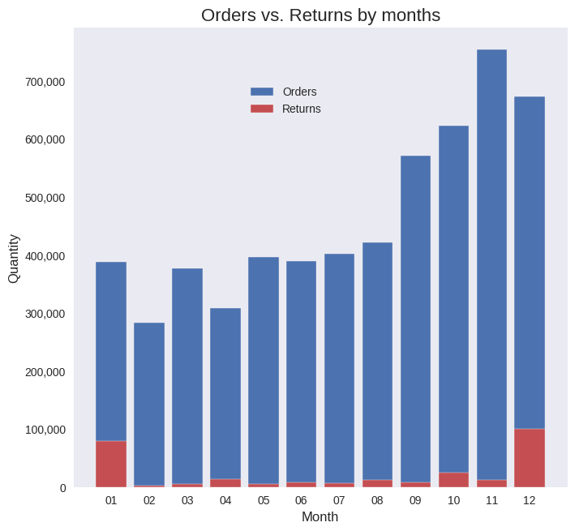
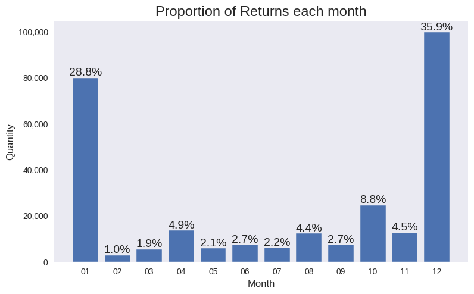

# 🌍 **Global Gift-Giving Behavior Analysis**  
### *Unveiling Insights into Consumer Behavior and Seasonal Trends in E-Commerce*  

---

## 📖 **Overview**  
This project explores global gift-giving behavior using e-commerce transaction data from the UC Irvine Machine Learning Repository. The goal was to uncover trends in seasonal sales, customer preferences, and regional patterns, providing actionable insights for businesses to optimize inventory planning and marketing strategies.  

Through **data cleaning**, **exploratory data analysis (EDA)**, and **visualization**, we analyzed annual sales trends, customer segmentation, and international vs. domestic sales dynamics, presenting our findings through interactive charts and visualizations.

---

## 🚀 **Key Features**  
- Comprehensive **EDA** using Python libraries like Pandas, Seaborn, Matplotlib, Plotly Express, and NumPy.  
- Data cleaning process that addressed **date inconsistencies**, **missing values**, and **anomalies** in transactions.  
- Created insightful visualizations, including a **Choropleth map** to highlight global sales distribution and **trend charts** to showcase monthly sales dynamics.  
- Identified actionable patterns, such as **seasonal demand spikes**, **best-selling products**, and **return rate trends**.  

---

## 📊 **Key Insights**  

### 1. **Seasonal Trends in Gift-Giving**  
- Sales peak during the holiday season (November-December), with notable spikes in gift-related product purchases.  
- A **20% increase** in sales volume was observed during these months compared to the yearly average.  

**Visualization:**  
  

---

### 2. **Regional Gift-Giving Preferences**  
- Domestic sales (UK) dominate, but international sales show growth in regions like Europe and North America.  
- Products with regional popularity were identified, enabling **targeted marketing campaigns**.  

**Visualization:**  
  

---

### 3. **Customer Behavior and Returns**  
- **High-value customers** contribute disproportionately to revenue. Loyalty programs targeting these customers can increase retention.  
- Return rates peaked in January, potentially due to post-holiday gift returns.  

**Visualization:**  
  

---

## 🛠️ **Tools and Technologies**  
- **Python Libraries:** Pandas, NumPy, Matplotlib, Seaborn, Plotly Express  
- **Data Source:** UC Irvine Machine Learning Repository  
- **Skills Used:** Data Cleaning, Feature Engineering, Statistical Analysis, Data Visualization  

---

## 🎯 **Challenges Faced**  
- **Handling Missing Data:** Many transactions lacked customer IDs, which required deriving meaningful insights without full customer-level segmentation.  
- **Regional Imbalance:** The dataset was skewed toward UK sales, requiring careful normalization for international analysis.  

---

## 📈 **Next Steps**  
- **Predictive Modeling:** Use the cleaned data to build a machine learning model for sales forecasting.  
- **Deeper Segmentation:** Explore additional customer demographics for more granular insights.  
- **Automated Dashboards:** Create interactive dashboards for stakeholders to monitor trends in real time.  

---
